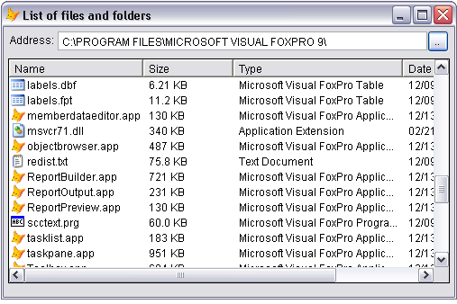

[ Home ](https://github.com/VFPX/Win32API)  

# List of samples in alphabetical order

## [A ](#A)[B ](#B)[C ](#C)[D ](#D)[E ](#E)[F ](#F)[G ](#G)[H ](#H)[I ](#I)[J ](#J)[L ](#L)[M ](#M)[N ](#N)[O ](#O)[P ](#P)[Q ](#Q)[R ](#R)[S ](#S)[T ](#T)[U ](#U)[V ](#V)[W ](#W)[Y ](#Y)

## [A class that encrypts and decrypts files using Cryptography API Functions](samples/sample_511.md)
This simple class uses several Cryptography API Functions to implement password-protected encryption and decryption of files.  
## [A client for testing non-blocking Winsock server](samples/sample_413.md)

## [A procedure for setting file times](samples/sample_128.md)

## [Accessing Adobe Reader 7.0 main menu from VFP application](samples/sample_495.md)
I was looking for a simple way of closing Adobe Reader document and leaving intact other open PDF documents and the reader itself. Presented AdobeAcrobat7 class enumerates opened pdf documents. It also can close any Acrobat document window or all document windows and more.  
## [Accessing LSA Policy object (Local Security Authority)](samples/sample_427.md)

## [Accessing Windows Control Panel from VFP Application](samples/sample_391.md)
This code shows how to launch various control panel property pages (like Internet Options) and wizards (like Add New Printer) from a VFP application. Normally you reach the Control Panel through Windows main menu item Settings.  
## [Accessing a CD device (cdaudio) with Multimedia Command Strings](samples/sample_279.md)

## [Accessing examples contained in this reference from a VFP application](samples/sample_197.md)

## [Accessing examples contained in this reference through Web Services](samples/sample_469.md)
This code uses GetListOfExamples  and GetExample  functions wrapped in XML Web Service. Requires VFP versions 8 or 9.   
## [Accessing the list of Windows Recent Documents](samples/sample_094.md)

## [Adding a background image to VFP report (VFP9, ReportListener)](samples/sample_562.md)

## [Adding an ODBC data source with the SQLConfigDataSource; use automatic or interactive mode](samples/sample_381.md)

## [Adding and deleting Scheduled Tasks using NetScheduleJob API functions](samples/sample_490.md)
With Scheduled Tasks, you can schedule any script, program, or document to run at a time that is most convenient for you. Scheduled Tasks starts each time you start Windows XP and runs in the background.  
## [Adding and deleting User Accounts](samples/sample_478.md)
FoxPro class UserAccount wraps NetUserAdd, NetUserDel, NetUserGetInfo and NetUserSetInfo API calls to add, delete and modify user accounts on a server.  
## [Adding printer to the list of supported printers for the specified server](samples/sample_335.md)

## [Adding supplementary data to AVI files](samples/sample_481.md)
The code explains how supplementary data (copyright, comments etc.) can be stored in AVI files.  
## [Adding user-defined items to the Control Menu of VFP form (requires VFP9)](samples/sample_512.md)
User-defined items can be added to the Control Menu of any VFP form. In VFP9 it is also possible to link such menu items to a method of the form.
  
## [An alternative way of setting Form.Closable to False](samples/sample_127.md)

## [Analyzing character types in a specified string](samples/sample_600.md)

## [Animating a transition of the VFP form (a wire-frame rectangle)](samples/sample_255.md)

## [Another way to go online (it is not about choosing an ISP)](samples/sample_141.md)

## [Attaching menu to a top-level form](samples/sample_208.md)

## [ Home ](https://github.com/VFPX/Win32API)[A ](#A)[B ](#B)[C ](#C)[D ](#D)[E ](#E)[F ](#F)[G ](#G)[H ](#H)[I ](#I)[J ](#J)[L ](#L)[M ](#M)[N ](#N)[O ](#O)[P ](#P)[Q ](#Q)[R ](#R)[S ](#S)[T ](#T)[U ](#U)[V ](#V)[W ](#W)[Y ](#Y)

## [Basic Volume information](samples/sample_098.md)

## [Bitmap Class for Visual FoxPro application](samples/sample_295.md)

## [Browsing Windows Known Folders (Special Folders)](samples/sample_576.md)

## [Building a tree of subdirectories for a given path using FindFile functions](samples/sample_236.md)

## [ Home ](https://github.com/VFPX/Win32API)[A ](#A)[B ](#B)[C ](#C)[D ](#D)[E ](#E)[F ](#F)[G ](#G)[H ](#H)[I ](#I)[J ](#J)[L ](#L)[M ](#M)[N ](#N)[O ](#O)[P ](#P)[Q ](#Q)[R ](#R)[S ](#S)[T ](#T)[U ](#U)[V ](#V)[W ](#W)[Y ](#Y)

## [Capturing keyboard activity of another application with the Raw Input API (VFP9)](samples/sample_572.md)

## [Changing file attributes](samples/sample_103.md)

## [Changing pitch and speed of a wave file](samples/sample_422.md)

## [Changing system colors](samples/sample_040.md)

## [Class for sound recording](samples/sample_420.md)

## [Class library providing access to the System Registry](samples/sample_472.md)
This code sample includes classes *registry*, *regkey*, *regkeys*, *regvalue* and *regvalues*. All together they provide view, read, write and delete functionality for the System Registry. Examples showing how to use this class are coming soon.  
## [Clipping mouse cursor area](samples/sample_080.md)
Mauricio Henao Romero
maohenao@hotmail.com
http://www.codefox.net/modules.php?name=News&file=article&sid=193  
## [Closing Windows](samples/sample_036.md)

## [Comparing dimensions of the VFP main window with _SCREEN properties](samples/sample_078.md)

## [Comparing file times](samples/sample_171.md)

## [Compressing and decompressing files with Windows API Runtime Library routines](samples/sample_568.md)

## [Configuring DEVMODE structure for a printer](samples/sample_384.md)

## [Confining Windows calculator inside the VFP main window](samples/sample_245.md)

## [Connecting a local device to a network resource](samples/sample_318.md)

## [Controlling master audio volume by sending WM_APPCOMMAND messages](samples/sample_592.md)
The WM_APPCOMMAND message allows to acquire medium level of control over several OS areas: speakers, microphone, media, browser, mail, default applications. This code sample shows how to mute, unmute and change the volume of the speakers. This technique provides no means of reading the volume level or the mute status.  
## [Converting Unicode data from the Clipboard to a character string using a given code page](samples/sample_316.md)

## [Converting a decimal string to an integer](samples/sample_106.md)

## [Converting a hexadecimal string to an integer](samples/sample_107.md)

## [Converting an HTTP time/date string to a SYSTEMTIME structure](samples/sample_328.md)

## [Converting an integer value to a hexadecimal string](samples/sample_260.md)

## [Converting characters in a URL into corresponding escape sequences and backwards](samples/sample_396.md)

## [Converting characters to upper or lower case](samples/sample_075.md)

## [Converting command-line string to a set of Unicode argument strings](samples/sample_212.md)

## [Converting image file to .ICO file](samples/sample_503.md)
This code sample shows how to load an image file (BMP, GIF, JPEG, PNG, TIFF), scale it and save as .ICO file. It creates a simple icon file containing one 32x32 icon in 32 bit per pixel format and assigns the new icon to the Icon property.  
## [Converting long file names to the short format and vice versa](samples/sample_055.md)

## [Converting path to original case](samples/sample_102.md)

## [Converting strings between ANSI and OEM](samples/sample_099.md)

## [Converting twips to pixels and vice versa](samples/sample_161.md)

## [Copying files as a transacted operation (Vista)](samples/sample_540.md)

## [Copying picture of the active form to the Clipboard using Enhanced Metafile API functions](samples/sample_404.md)

## [Copying strings through the global memory block](samples/sample_156.md)

## [Creating a clipping region from the path selected into the device context of a form](samples/sample_144.md)

## [Creating a console window for Visual FoxPro application](samples/sample_474.md)
The code explains how to create and use console (DOS-like) window with Visual FoxPro application.  
## [Creating a device context for the specified printer](samples/sample_145.md)

## [Creating a directory on the FTP](samples/sample_047.md)

## [Creating a file, then moving it to another destination](samples/sample_015.md)

## [Creating a folder](samples/sample_001.md)

## [Creating a mailslot](samples/sample_267.md)

## [Creating a unique filename based on existing filename](samples/sample_014.md)

## [Creating a window using CreateWindowEx function](samples/sample_050.md)

## [Creating an Open dialog box to specify the drive, directory, and name of a file to open (Shell32 version)](samples/sample_365.md)

## [Creating hash values for the list of names](samples/sample_179.md)

## [Creating irregularly shaped FoxPro form using transparency color key](samples/sample_033.md)
The SetLayeredWindowAttributes function can be used to define the transparency color for the top-level FoxPro form. That means all areas on the form with this color, including native windowless FoxPro controls, become transparent.   
## [Creating the Open dialog box to specify the drive, directory, and name of a file to open](samples/sample_363.md)

## [Creating the Save dialog box to specify the drive, directory, and name of a file to save](samples/sample_265.md)

## [Creating two-byte hashes for a list of URLs](samples/sample_180.md)

## [CryptoAPI: Collection of Providers class](samples/sample_463.md)
The CryptoAPI Providers class presents collection of cryptographic service providers (CSP) available on a computer. Each provider is described with type, name, collections of available containers and algorithms.  
## [Current System information](samples/sample_096.md)

## [Current directory of the application](samples/sample_004.md)

## [Current keyboard type](samples/sample_095.md)

## [Custom FTP Class for Visual FoxPro application](samples/sample_344.md)

## [Custom GDI+ class](samples/sample_450.md)

## [Custom HttpRequest class (WinHTTP)](samples/sample_397.md)

## [Custom HttpRequest class (WinINet)](samples/sample_185.md)
This class is used for sending "GET" and "POST" HTTP requests to webserver and receiving responses.  
## [Customizing the frame of top-level form: removing the standard frame (VFP9, Vista)](samples/sample_574.md)

## [ Home ](https://github.com/VFPX/Win32API)[A ](#A)[B ](#B)[C ](#C)[D ](#D)[E ](#E)[F ](#F)[G ](#G)[H ](#H)[I ](#I)[J ](#J)[L ](#L)[M ](#M)[N ](#N)[O ](#O)[P ](#P)[Q ](#Q)[R ](#R)[S ](#S)[T ](#T)[U ](#U)[V ](#V)[W ](#W)[Y ](#Y)

## [Deleting files into the Recycle Bin](samples/sample_321.md)

## [Detecting changes in connections to removable drives (VFP9)](samples/sample_573.md)

## [Determining if an Active Network Connection is Available](samples/sample_324.md)

## [Determining whether or not the system is connected to the Internet](samples/sample_322.md)

## [Dial the Net Automatically](samples/sample_140.md)

## [Disabling drawing in the VFP form](samples/sample_257.md)

## [Disabling mouse and keyboard input for the main VFP window (with the app still running)](samples/sample_083.md)

## [Disconnecting USB Mass Storage Device programmatically](samples/sample_553.md)

## [Disk in drive A:](samples/sample_319.md)

## [DiskFreeSpace class](samples/sample_100.md)

## [Displaying OS Memory Status](samples/sample_020.md)

## [Displaying all TCP connections for the local system](samples/sample_222.md)

## [Displaying animated images on FoxPro form with BitBlt and StretchBlt functions](samples/sample_355.md)

## [Displaying bitmap using the AlphaBlend function](samples/sample_293.md)

## [Displaying dimmed window behind VFP top-level form](samples/sample_578.md)

## [Displaying hypertext links with the SysLink control (VFP9, Comctl32.dll)](samples/sample_559.md)

## [Displaying icons in the system tray (VFP9)](samples/sample_235.md)

## [Displaying printer-properties Property Sheet for the specified printer](samples/sample_372.md)

## [Displaying standard progress dialog box when copying files](samples/sample_508.md)
If you have ever thought about retiring ageing VFP commands COPY FILE and RENAME then give this code a try. 

The SHFileOperation copies, deletes and moves a file or multiple files. A variety of flags the fFlags member can take provides great flexibility. For example, in a single SHFileOperation call a group of files can be copied not to just one but to several destinations. The process is accompanied with familiar OS dialogs showing the progress or sending a reminder when existing file is about  to be replaced.  
## [Displaying system dialog that selects a folder](samples/sample_364.md)

## [Displaying the associated icons and descriptions for files and folders](samples/sample_530.md)
When the list of files and folders is to be displayed inside a VFP form, the ListBox VFP control and the ListView ActiveX control are probably the first two candidates for the job. 

The ListBox's presentation style can only be described as the minimalistic :) , while the ListView shows items in much fancier manner, and can even accompany each file and folder with an icon.

And an imminent question arises: where are those icons stored and how to put them to work?  
## [Displaying the color palette stored in an image file](samples/sample_529.md)
Depending on its bit per pixel mode, an image file can store a color palette inside its data. GDI+ functions GdipGetImagePalette and GdipGetImagePaletteSize allow to retrieve the palette in a form of ColorPalette structure.
  
## [Displaying the drive type value](samples/sample_012.md)

## [Displaying the main Dial-Up Networking dialog box](samples/sample_331.md)

## [Downloading files from the FTP server using InternetReadFile](samples/sample_063.md)

## [Dragging files from Explorer window and dropping them on FoxPro control (requires VFP9)](samples/sample_323.md)

## [Drawing Windows frame controls using the DrawFrameControl function](samples/sample_254.md)

## [Drawing Windows predefined bitmaps using the LoadBitmap functions](samples/sample_253.md)

## [Drawing a rectangle using Windows regular edges and borders](samples/sample_256.md)

## [Drawing a window caption using the DrawCaption routine](samples/sample_238.md)

## [Drawing cursors for the classes defined by the system (preregistered): BUTTON, EDIT, LISTBOX etc.](samples/sample_203.md)

## [Drawing icons associated with the VFP main window](samples/sample_202.md)

## [Drawing standard Windows icons](samples/sample_112.md)

## [Dynamic strings implemented through VFP Custom class](samples/sample_157.md)

## [ Home ](https://github.com/VFPX/Win32API)[A ](#A)[B ](#B)[C ](#C)[D ](#D)[E ](#E)[F ](#F)[G ](#G)[H ](#H)[I ](#I)[J ](#J)[L ](#L)[M ](#M)[N ](#N)[O ](#O)[P ](#P)[Q ](#Q)[R ](#R)[S ](#S)[T ](#T)[U ](#U)[V ](#V)[W ](#W)[Y ](#Y)

## [Encapsulating access to the Windows Services in a class](samples/sample_476.md)
The winservices class, subclassed from the Collection class, enumerates Windows Services found in the default service control manager database on local computer. Each item in the collection is an instance of the winservice class that wraps the members of ENUM_SERVICE_STATUS structure for a given service. The winservice object exposes methods StartService, StopService and PauseService.  
## [Enhanced GetFont dialog](samples/sample_159.md)

## [Enumerating MIDI output devices](samples/sample_507.md)

## [Enumerating ODBC Data Sources available on the local computer](samples/sample_284.md)
The code shows how to use SQLDataSources function to retrieve lists of available Data Sources (either System or User DSNs).  
## [Enumerating ODBC drivers available on the local computer](samples/sample_285.md)

## [Enumerating Performance Counters](samples/sample_565.md)

## [Enumerating Processes -- Win9*](samples/sample_164.md)

## [Enumerating Processes -- WinNT](samples/sample_162.md)

## [Enumerating Volumes and Volume Mounting Points (NTFS)](samples/sample_087.md)

## [Enumerating connections made to a shared resource for the local computer (WinNT only)](samples/sample_168.md)

## [Enumerating data formats currently available on the clipboard](samples/sample_032.md)

## [Enumerating devices installed on the local machine](samples/sample_545.md)
The PnP manager maintains a device tree that keeps track of the devices in the system.

The device tree contains information about the devices present on the system. The PnP manager builds this tree when the machine boots, using information from drivers and other components, and updates the tree as devices are added or removed.  
## [Enumerating files opened on the network](samples/sample_121.md)

## [Enumerating forms supported by a specified printer](samples/sample_390.md)

## [Enumerating global and local group accounts on a server (WinNT/XP/2K)](samples/sample_411.md)

## [Enumerating network resources](samples/sample_313.md)
The code uses WNet API calls to enumerate all resources on the network.  
## [Enumerating network sessions established on a server](samples/sample_505.md)

## [Enumerating ports that are available for printing on a specified server](samples/sample_334.md)

## [Enumerating print jobs and retrieving information for default printer (JOB_INFO_1 structures)](samples/sample_368.md)

## [Enumerating print processors and supporting data types installed on the specified server](samples/sample_333.md)

## [Enumerating printer drivers installed](samples/sample_082.md)

## [Enumerating raw input devices attached to the system (keyboard, mouse, human interface device)](samples/sample_571.md)

## [Enumerating servers of the specified type (e.g. SQL Server) in the primary domain](samples/sample_165.md)

## [Enumerating the subkeys for a given registry key](samples/sample_130.md)

## [Enumerating the subkeys of a user-specific key](samples/sample_129.md)

## [Establishing connection using the SQLDriverConnect](samples/sample_290.md)

## [Exporting DLL icon resources as .ICO files](samples/sample_502.md)
This code includes definitions for three classes: IconGroups, IconGroupResource and IconResource. The IconGroups is a collection of the IconGroupResource objects. The icons property of the IconGroupResource class is a collection of the IconResource objects.

The IconGroupResource and IconResource classes include SaveToFile method that saves the resource to .ICO file.
  
## [Extended MessageBox Class](samples/sample_418.md)

## [Extended OS Version info](samples/sample_023.md)

## [Extensible Storage Engine class library](samples/sample_532.md)

## [Extracting the name and extension parts of a path string](samples/sample_118.md)

## [ Home ](https://github.com/VFPX/Win32API)[A ](#A)[B ](#B)[C ](#C)[D ](#D)[E ](#E)[F ](#F)[G ](#G)[H ](#H)[I ](#I)[J ](#J)[L ](#L)[M ](#M)[N ](#N)[O ](#O)[P ](#P)[Q ](#Q)[R ](#R)[S ](#S)[T ](#T)[U ](#U)[V ](#V)[W ](#W)[Y ](#Y)

## [FindText -- the hopeless and useless Common Dialog](samples/sample_160.md)

## [Finding out if the current user is the Guest account](samples/sample_566.md)
In this code sample, the CurrentUser class wraps call to the NetUserGetInfo that populates USER_INFO_1 structure. The usri1_priv member of this struture indicates if the user account is Guest or Admin.  
## [Finding parameters for the region specified](samples/sample_124.md)

## [Finding the application, icon and friendly names associated with a file name](samples/sample_584.md)

## [Finding the path to the VFP executable running](samples/sample_086.md)

## [Form Magnifier](samples/sample_414.md)

## [ Home ](https://github.com/VFPX/Win32API)[A ](#A)[B ](#B)[C ](#C)[D ](#D)[E ](#E)[F ](#F)[G ](#G)[H ](#H)[I ](#I)[J ](#J)[L ](#L)[M ](#M)[N ](#N)[O ](#O)[P ](#P)[Q ](#Q)[R ](#R)[S ](#S)[T ](#T)[U ](#U)[V ](#V)[W ](#W)[Y ](#Y)

## [GDI+ fun: roach-infested desktop](samples/sample_548.md)

## [GDI+: Color Transparency](samples/sample_549.md)
With the GDI+, an image can be drawn on a Graphics object having a selected single color or a range of colors made transparent.  
## [GDI+: Creating thumbnails to preview images in a directory](samples/sample_547.md)
This code sample displays thumbnails for JPEG images found in a specified directory. The thumbnails on the form are dynamically highlighted following the movements of the cursor.  
## [GDI+: Drawing a Pie Chart](samples/sample_514.md)
This code sample shows how to use PieChart GDI+ functions to build a simple chart and store it in a graphics file.  
## [GDI+: Implementing image scrolling with inertia](samples/sample_595.md)
The inertial scrolling can be described as below: 
After releasing the mouse button, the image scrolling coninues while decelerating slowly, simulating the presence of inertia. The level of the deceleration depends on the momentum the mouse cursor obtains at the button release.
  
## [GDI+: Scrolling through large image using the mouse](samples/sample_546.md)

## [GDI+: Storing DLL icon resources in image files](samples/sample_501.md)

## [GDI+: Storing content of the Clipboard to a bitmap file](samples/sample_475.md)
Based on GdiPlus class, this code shows how to retrieve an image stored on the clipboard and save it to a graphics file in one of GDI+ supported formats, BMP, GIF. PNG, TIFF, JPEG.  
## [GDI+: Using Scale and Shear transformations](samples/sample_479.md)
A transformation is a process that changes graphics objects from one state to another. Rotation, scaling, reflection, translation, and shearing are some examples of transformation. Transformations can be applied to graphics shapes, curves, images and to image colors.
  
## [GDI+: converting text strings to images and saving in a graphics file](samples/sample_513.md)
In this code sample lines of text are printed on GDI+ bitmap object using a specified font. The result is saved in a graphics file. Such functionality can be used, for example, for displaying adhoc images on a web page.

Before creating the target bitmap, the GdipMeasureString function is used to calculate the bounding rectangle for the lines of text drawn with a specified font.  
## [GDI+: copying to the Clipboard (a) image of active FoxPro window/form, (b) image file](samples/sample_457.md)

## [GDI+: creating a gradient](samples/sample_596.md)

## [GDI+: creating scaled copy of image file](samples/sample_460.md)

## [GDI+: cropping images](samples/sample_515.md)
This code sample explains how to load an image from a file, crop it using GdipDrawImageRectI GDI+ function and save result in another file.  
## [GDI+: custom Clock Control](samples/sample_597.md)

## [GDI+: custom control, base class](samples/sample_599.md)

## [GDI+: how to make VFP controls visually shake and shudder](samples/sample_526.md)
Shuddering control may appear a good way to get user's immediate attention. For example, when Purchase Order form opens, and the shipping date is not entered or overdue, the textbox hosting this value may start vibrate and thus can be easily spotted by the user.  
## [GDI+: printing image file](samples/sample_452.md)

## [GDI+: reading and writing metadata in JPEG and TIFF files](samples/sample_461.md)
The code shows how to store and retrieve metadata in image files. **Metadata** is defined as *"Data about data, or information known about the image in order to provide access to the image"*. It may be, for example, a shatter speed value for your digital camera or description to a birthday party picture.  
## [GDI+: retrieving list of available image encoders and image decoders](samples/sample_459.md)

## [GDI+: saving image of FoxPro form to graphics file (BMP, GIF, JPG, PNG, TIF)](samples/sample_454.md)

## [GDI+: sending image of FoxPro form to printer](samples/sample_455.md)

## [Generating UUID values from numbers](samples/sample_588.md)

## [Generating random UUID values](samples/sample_024.md)

## [Generating random cryptographic keys](samples/sample_590.md)
The CryptKeyHelper class defined in the code sample below is a wrapper around Windows API Cryptography functions. It implements methods allowing to generate a random cryptographic key, to export the key to a specified file, and to import a key from a specified file.  
## [Generating sequential UUID values](samples/sample_587.md)

## [Get the power status of your laptop computer](samples/sample_006.md)

## [GetFileOwner - Get the owner of an NTFS file](samples/sample_433.md)

## [GetFocus returns a HWND value](samples/sample_090.md)

## [GetProcessVersion points at target OS](samples/sample_170.md)

## [Getting a bit more than the _CLIPTEXT offers](samples/sample_278.md)

## [ Home ](https://github.com/VFPX/Win32API)[A ](#A)[B ](#B)[C ](#C)[D ](#D)[E ](#E)[F ](#F)[G ](#G)[H ](#H)[I ](#I)[J ](#J)[L ](#L)[M ](#M)[N ](#N)[O ](#O)[P ](#P)[Q ](#Q)[R ](#R)[S ](#S)[T ](#T)[U ](#U)[V ](#V)[W ](#W)[Y ](#Y)

## [HOWTO: Use the Win32 API to Access File Dates and Times](samples/sample_177.md)

## [Hiding mouse cursor](samples/sample_139.md)

## [High-powered ALLTRIM](samples/sample_104.md)

## [How to Start a Process as Another User (NT/XP/2K)](samples/sample_426.md)

## [How to access a file using not its name but an alias (hard link)](samples/sample_018.md)

## [How to activate Windows Calculator](samples/sample_026.md)

## [How to adjust monitor brightness (Vista, monitor with DDC support)](samples/sample_543.md)
The Monitor Configuration API was first made available in Windows Vista. These functions are applicable only if the monitor supports the Display Data Channel (DDC/CI) connection with the graphics adapter.  
## [How to assemble an array of strings and pass it to external function](samples/sample_487.md)
The PathFindOnPath function is anything but special. Whatever it does, can be accomplished by using FILE() and GETENV() FoxPro functions. Though it gives me a chance to demonstrate a technique of assembling an array of strings for being passed to external function.  
## [How to block the ALT+TAB shortcut (WinXP)](samples/sample_432.md)

## [How to block the PrintScreen key](samples/sample_489.md)
The PrintScreen key sends to the Clipboard either whole screen or just the active window (if pressed together with ALT key). To prevent windows of your application to be captured and printed by users through pressing this key, use RegisterHotKey API function. Still this solution does not provide absolute protection. A determined user may use third-party screen capturing utility that is not associated with the PrintScreen key and the Clipboard.   
## [How to browse and connect to printers on a network (WinNT)](samples/sample_376.md)

## [How to build UDP responder](samples/sample_052.md)

## [How to change display settings: screen resolution, screen refresh rate](samples/sample_374.md)
Even if it is not always bright idea to change display resolution from your application, still it is comfortable to know that there is a way to do it.  
## [How to change the name and the size of the font in the MessageBox dialog](samples/sample_434.md)

## [How to check whether the system is 32-bit or 64-bit](samples/sample_580.md)

## [How to control Adobe Reader 9.0 (SDI mode) from VFP application](samples/sample_550.md)
Each Adobe Reader 9 window is created from window class AcrobatSDIWindow and parented by the Windows Desktop.  Enumeration of child windows of this class within the Desktop window returns the exact number of open Adobe Acrobat 9 documents.

The AdobeReaderSDIWindow class is able to virtually "click on" an item in the main menu of Adobe Reader 9 window and in this way to control some of the functionality.  
## [How to convert a bitmap file to monochrome format (1 bpp)](samples/sample_493.md)
It all started with a question I have noticed in the Universal Thread Visual FoxPro forum:*Does anyone know how to create a monochrome bitmap or monochrome tiff file from a VFP report? *
  
## [How to copy the image of a form to the Clipboard using Bitmap API functions](samples/sample_091.md)

## [How to create MD-5 and SHA-1 hash values from a string](samples/sample_483.md)
MD-5 is a one-way message-digest hash function. The algorithm processes input text and creates a 128-bit message digest which is unique to the message and can be used to verify data integrity. The example shows how to create an MD-5 hash for a string using CryptoAPI calls.  
## [How to create a service object](samples/sample_517.md)

## [How to create non-blocking Winsock server](samples/sample_412.md)

## [How to create transparent areas inside a form -- punching holes in the form](samples/sample_126.md)

## [How to delete IE cookies, clear IE history and delete files in Temporary Internet Files directory](samples/sample_471.md)
The following example presents session class *CacheEntry* and collection class *CacheEntries*. The latter, when created, enumerates Internet cache entries, either cookies or history or cached files depending on the search pattern. Cache entries can be deleted through *DeleteCacheEntry* and *DeleteCacheEntries* methods of the collection class.  
## [How to delete a service object](samples/sample_518.md)

## [How to delete all print jobs for a printer](samples/sample_370.md)

## [How to delete file on FTP server](samples/sample_071.md)

## [How to detect if additional monitor is connected and active](samples/sample_542.md)
Nowadays having two monitors connected to a PC becomes more a common place rather than exception. This code sample explains how to detect all available monitors through enumerating display devices and their properties.  
## [How to disable the Windows Clipboard (VFP9)](samples/sample_488.md)
The Windows OS has a mechanism that allows to notify a window when the content of the clipboard changes. Any FoxPro window can be registered as a clipboard viewer. The notifications are actually window messages. And VFP9 handles window messages really good due to extended BINDEVENT() function.  
## [How to display Windows On-Screen Keyboard](samples/sample_582.md)

## [How to display a Task Dialog (Vista)](samples/sample_557.md)

## [How to display a dialog box with which the user can add a data source (DSN)](samples/sample_380.md)

## [How to display a user-defined icon in the MessageBox dialog](samples/sample_500.md)

## [How to display advanced Task Dialog (Vista)](samples/sample_558.md)

## [How to display picture stored in enhanced-format metafile (*.emf)](samples/sample_403.md)

## [How to display the Print property sheet](samples/sample_531.md)

## [How to display the Properties dialog box for a file (ShellExecuteEx)](samples/sample_320.md)

## [How to display the port-configuration dialog box for a port on the specified server](samples/sample_362.md)

## [How to download a file from HTTP server using URL Monikers functions](samples/sample_175.md)

## [How to download a file from the FTP server using FtpGetFile](samples/sample_043.md)

## [How to download this reference's archive through WinInet functions using InternetOpenUrl](samples/sample_110.md)

## [How to drag a Form not using its Titlebar or Caption](samples/sample_195.md)

## [How to draw custom Window Caption on FoxPro form](samples/sample_499.md)
This code sample shows how to hide the Caption and the border of FoxPro form and replace them with eight Image controls and one Label control. The form is resizable, closable and can be clicked on its caption and dragged.
  
## [How to empty the Recycle Bin](samples/sample_301.md)

## [How to enable the SE_SHUTDOWN_NAME privilege for the application](samples/sample_552.md)
To shut down or to reboot the system (API calls ExitWindowsEx, InitiateShutdown and others) the process must have the SE_SHUTDOWN_NAME privilege (default behaviour on Vista).  
## [How to enumerate cookies and URL History entries in the cache of the local computer](samples/sample_350.md)

## [How to enumerate logon sessions on local computer](samples/sample_591.md)

## [How to enumerate sessions and processes on a specified terminal server](samples/sample_519.md)

## [How to enumerate terminal servers within the specified Windows domain](samples/sample_520.md)

## [How to enumerate, add and delete shares on the local computer (WinNT/XP)](samples/sample_351.md)

## [How to extract frames from AVI files](samples/sample_484.md)
The example presents the AviBrowser class. This class can open AVI file and convert its frames into bitmap files. The AviBrowser object is shown used as a control on FoxPro form. For that reason, it is subclassed from the Image control.  
## [How to fill a buffer with random bytes using Cryptography API Functions](samples/sample_053.md)

## [How to find the application associated with a file name](samples/sample_138.md)

## [How to find when the application started](samples/sample_534.md)

## [How to find which fonts Windows uses for drawing captions, menus and message boxes](samples/sample_556.md)
Calling SystemParametersInfo with SPI_GETNONCLIENTMETRICS input parameter populates the NONCLIENTMETRICS structure. This structure contains the metrics associated with the nonclient area of a nonminimized window. Among the metrics included are the settings for 5 fonts, the OS uses for drawing captions, small captions, menus, status bars and message boxes.  
## [How to generate GUID values](samples/sample_456.md)

## [How to get the path to a Special Folder](samples/sample_415.md)

## [How to hide your program from the Close Program dialog (Win9* only)](samples/sample_277.md)

## [How to hot-track menu item selection in top-level form (requires VFP9)](samples/sample_521.md)
This code shows how VFP top-level form can get notified upon its menu item selection. Note that the menu item is not clicked on, but selected by the mouse hovering over it or by the keyboard.  
## [How to initiate System shutdown](samples/sample_122.md)

## [How to intercept window messages sent to VFP form](samples/sample_307.md)

## [How to load a user profile](samples/sample_602.md)

## [How to make a VFP form fading out when released (GDI version)](samples/sample_528.md)
When a VFP form is released, usually it disappears immediately. Wouldn't it be nice to have the form slowly (or less slowly) fading out?

An obvious way of doing that is covering the form with another window, which holds the image of the original form. Once covered, the original form disappears. After that the covering window gradually changes its opacity (alpha channel) from opaque (255) to completely transparent (0).  
## [How to make a VFP form fading out when released (GDI+ version)](samples/sample_527.md)
When a VFP form is released, usually it disappears immediately. Wouldn't it be nice to have the form slowly (or less slowly) fading out?

An obvious way of doing that is covering the form with another window, which holds the image of the original form. Once covered, the original form disappears. After that the covering window gradually changes its opacity (alpha channel) from opaque (255) to completely transparent (0).  
## [How to make application automatically close all documents it opened](samples/sample_491.md)
Imagine FoxPro application that has opened several windows like Word, Excel, PDF, browser, picture viewer etc. Closing all those documents automatically on exit from the application, sometimes this can be a good idea.

Here is one of several possible ways to get it done. Windows XP/2K introduces a Job Object, a tool that can manage a group of processes as a single process. In other words, operations performed on the job object affect all processes associated with it.
  
## [How to make the caption of a VFP application flashing in the Windows task bar](samples/sample_228.md)

## [How to obtain Content-Type value for a file type from the System Registry](samples/sample_468.md)
The code shows how to read the list of content-type values registered on local computer and how to obtain content-type value for a particular file extension. Content-type values can be used when creating HTTP and SMTP headers.  
## [How to obtain the number of rows affected by remote UPDATE, INSERT or DELETE statement](samples/sample_416.md)

## [How to perform Base64 encoding/decoding using Cryptography API Functions](samples/sample_088.md)

## [How to ping a remote site using ICMP API calls](samples/sample_486.md)
The Ping class uses several API functions -- IcmpCreateFile, IcmpCloseHandle, IcmpSendEcho and others -- to send an ICMP Echo request and get a reply (RTT, round-trip time).   
## [How to ping a remote site using IP Helper API calls](samples/sample_382.md)

## [How to play AVI file on the _screen](samples/sample_430.md)

## [How to play MIDI notes](samples/sample_537.md)
Set the note in 0 to 127 range and the velocity (how hard the key is pressed) in 20 to 200+ range and press Enter.  
## [How to play a waveform sound (a WAV file in particular)](samples/sample_251.md)

## [How to position the GETPRINTER() dialog](samples/sample_482.md)
The GETPRINTER() dialog normaly appears at the left top corner of the main window of FoxPro. What if you want it to popup in the middle of the screen? The interface has no input parameters that can be used to position the dialog. Still the Timer control and several API calls can solve this small problem.  
## [How to prevent users from accessing the Windows Desktop and from switching to other applications](samples/sample_492.md)
Sometimes you may need a computer with a single application running on it, and with all other applications and resources hidden from users. An example, Indigo Book Store customers can only search books when using public computers in the store.
  
## [How to print FoxPro form](samples/sample_158.md)

## [How to print FoxPro form -- II](samples/sample_406.md)

## [How to print a bitmap file](samples/sample_211.md)

## [How to print picture stored in enhanced-format metafile (*.emf)](samples/sample_405.md)

## [How to put a horizontal text scrolling on the form (a news line, marquee)](samples/sample_352.md)

## [How to put a vertical text scrolling on the form (a movie cast)](samples/sample_354.md)

## [How to read email messages using Simple MAPI](samples/sample_270.md)

## [How to release and renew a lease on an IP address previously obtained through Dynamic Host Configuration Protocol (DHCP)](samples/sample_349.md)

## [How to remove FTP directory](samples/sample_070.md)

## [How to remove a directory that is not empty](samples/sample_541.md)
As you know, the RMDIR generates an error message when an attempt made to remove a directory that is not empty. This example shows how to remove a directory with files based on the SHFileOperation call.  
## [How to retrieve adapter information for the local computer (including MAC address)](samples/sample_347.md)

## [How to retrieve configuration data for a specified printer stored in the registry (PrinterDriverData key)](samples/sample_369.md)

## [How to retrieve information about a cache entry (Internet Explorer)](samples/sample_332.md)

## [How to retrieve list of system DSNs (Data Source Name) with parameters](samples/sample_375.md)
The code shows how to use the SQLGetPrivateProfileString function to retrieve lists of current Data Sources (either System or User DSNs).  
## [How to retrieve network parameters for the local computer (including Host name, Domain name, and DNS Server)](samples/sample_348.md)

## [How to retrieve the number of objects stored in the Recycle Bin](samples/sample_302.md)

## [How to retrieve the number of print jobs queued for the printer](samples/sample_367.md)

## [How to retrieve the size of a remote file (FTP)](samples/sample_069.md)

## [How to retrieve version information for the specified file](samples/sample_480.md)
The FileVersionInfo class encapsulates GetFileVersionInfo API call and provides read-only access to structures VS_VERSIONINFO and VS_FIXEDFILEINFO.  
## [How to run FoxPro application under different user name (impersonating user)](samples/sample_470.md)
This example shows how to switch to another domain user within FoxPro application. It can be used for providing limited access to network resources (files, printers) for network users.  
## [How to save registry key including its subkeys and values to a file](samples/sample_135.md)

## [How to set Creation Date/Time for a folder (WinNT)](samples/sample_399.md)

## [How to start the screen saver and how to find whether the screen saver is active](samples/sample_196.md)

## [How to suspend or hibernate your system](samples/sample_395.md)

## [How to test file attributes (key method for FileExists and DirectoryExists routines)](samples/sample_097.md)

## [How to view icons stored in executable files (Icon Viewer)](samples/sample_113.md)

## [How to view icons stored in executable files (Icon Viewer) - II](samples/sample_019.md)

## [How to view system icons for the classes installed on the local machine](samples/sample_544.md)
The bitmap images for the classes installed on the machine are stored in some system area. These images are more of a general kind and illustrate functionality groups rather than individual classes. With a few API calls VFP application can access these images and display them in TreeView and ListView controls as icons.  
## [How to write and read Window Properties for the specified window](samples/sample_205.md)

## [ Home ](https://github.com/VFPX/Win32API)[A ](#A)[B ](#B)[C ](#C)[D ](#D)[E ](#E)[F ](#F)[G ](#G)[H ](#H)[I ](#I)[J ](#J)[L ](#L)[M ](#M)[N ](#N)[O ](#O)[P ](#P)[Q ](#Q)[R ](#R)[S ](#S)[T ](#T)[U ](#U)[V ](#V)[W ](#W)[Y ](#Y)

## [Initiating Inet connection using a modem](samples/sample_312.md)

## [ Home ](https://github.com/VFPX/Win32API)[A ](#A)[B ](#B)[C ](#C)[D ](#D)[E ](#E)[F ](#F)[G ](#G)[H ](#H)[I ](#I)[J ](#J)[L ](#L)[M ](#M)[N ](#N)[O ](#O)[P ](#P)[Q ](#Q)[R ](#R)[S ](#S)[T ](#T)[U ](#U)[V ](#V)[W ](#W)[Y ](#Y)

## [Joining local computer to a domain (XP/2000)](samples/sample_439.md)

## [ Home ](https://github.com/VFPX/Win32API)[A ](#A)[B ](#B)[C ](#C)[D ](#D)[E ](#E)[F ](#F)[G ](#G)[H ](#H)[I ](#I)[J ](#J)[L ](#L)[M ](#M)[N ](#N)[O ](#O)[P ](#P)[Q ](#Q)[R ](#R)[S ](#S)[T ](#T)[U ](#U)[V ](#V)[W ](#W)[Y ](#Y)

## [List of ODBC drivers installed (read from the [ODBC Drivers] section)](samples/sample_378.md)

## [List of addresses in the AutoDial mapping database](samples/sample_330.md)

## [Listing INF files in a specified directory](samples/sample_169.md)

## [Listing child windows for the Windows desktop](samples/sample_027.md)

## [Listing device drivers in the system: load addresses, names](samples/sample_174.md)

## [Loading a string resource from an executable file](samples/sample_213.md)

## [Locking and unlocking file of a VFP table](samples/sample_154.md)

## [Locking mouse and keyboard input for the VFP application](samples/sample_084.md)

## [Locking the workstation](samples/sample_300.md)

## [ Home ](https://github.com/VFPX/Win32API)[A ](#A)[B ](#B)[C ](#C)[D ](#D)[E ](#E)[F ](#F)[G ](#G)[H ](#H)[I ](#I)[J ](#J)[L ](#L)[M ](#M)[N ](#N)[O ](#O)[P ](#P)[Q ](#Q)[R ](#R)[S ](#S)[T ](#T)[U ](#U)[V ](#V)[W ](#W)[Y ](#Y)

## [MSMQ: how to open a queue](samples/sample_603.md)

## [Managing Cookies](samples/sample_186.md)

## [MapiSendMail class for Visual FoxPro application](samples/sample_342.md)

## [Mapping and disconnecting network drives](samples/sample_387.md)

## [Memory usage info for current VFP session (WinNT only)](samples/sample_172.md)

## [Minimizing all running applications](samples/sample_244.md)

## [Monitoring changes in a directory](samples/sample_117.md)

## [Monitoring changes occurring within a directory](samples/sample_400.md)

## [Monitoring clipboard content changes (VFP9)](samples/sample_601.md)

## [Moving shortcut to a specified position on the Windows Desktop](samples/sample_581.md)

## [ Home ](https://github.com/VFPX/Win32API)[A ](#A)[B ](#B)[C ](#C)[D ](#D)[E ](#E)[F ](#F)[G ](#G)[H ](#H)[I ](#I)[J ](#J)[L ](#L)[M ](#M)[N ](#N)[O ](#O)[P ](#P)[Q ](#Q)[R ](#R)[S ](#S)[T ](#T)[U ](#U)[V ](#V)[W ](#W)[Y ](#Y)

## [Number of clipboard formats available](samples/sample_031.md)

## [ Home ](https://github.com/VFPX/Win32API)[A ](#A)[B ](#B)[C ](#C)[D ](#D)[E ](#E)[F ](#F)[G ](#G)[H ](#H)[I ](#I)[J ](#J)[L ](#L)[M ](#M)[N ](#N)[O ](#O)[P ](#P)[Q ](#Q)[R ](#R)[S ](#S)[T ](#T)[U ](#U)[V ](#V)[W ](#W)[Y ](#Y)

## [OS version and revision](samples/sample_022.md)

## [Obtaining I/O counts for the current process](samples/sample_535.md)

## [Obtaining MAC address through Address Resolution Protocol (ARP) request](samples/sample_585.md)

## [Obtaining OS memory performance information](samples/sample_567.md)

## [Obtaining Shell32.dll version](samples/sample_299.md)

## [Obtaining a handle to the desktop associated with the calling thread](samples/sample_239.md)

## [Obtaining addresses for the adapters on the local computer (Win XP/2003/Vista)](samples/sample_506.md)

## [Obtaining current Internet Explorer browser version and UserAgent](samples/sample_142.md)

## [Obtaining heap handles and enumerating memory blocks for the current VFP session (WinNT only)](samples/sample_176.md)

## [Obtaining information about all user accounts on a server (WinNT only)](samples/sample_249.md)

## [Obtaining list of tables stored in an ODBC Data Source](samples/sample_409.md)

## [Obtaining names and positions for shortcuts located on the Windows Desktop](samples/sample_579.md)

## [Obtaining names of local and global groups for current user (WinNT/XP/2K)](samples/sample_431.md)

## [Obtaining physical parameters for a drive: sectors, clusters, cylinders...](samples/sample_101.md)
The code shows how to obtain number of cylinders, tracks, sectors and clusters for a given device like HD, floppy or CD.  
## [Obtaining provider name for a specific type of network](samples/sample_311.md)

## [Obtaining some properties for the Windows desktop using the GetWindowPlacement function](samples/sample_263.md)

## [Obtaining the System and Windows folder names](samples/sample_005.md)

## [Obtaining the bounding rectangle for the specified device context](samples/sample_237.md)

## [Obtaining window class name for the main VFP window](samples/sample_049.md)

## [One more way to retrieve environment strings](samples/sample_132.md)

## [Open and close a Simple MAPI Session](samples/sample_190.md)

## [Opening access to the Microsoft Internet functions for the application](samples/sample_042.md)

## [Opening the Page Setup dialog box to specify the attributes of a printed page](samples/sample_272.md)

## [ Home ](https://github.com/VFPX/Win32API)[A ](#A)[B ](#B)[C ](#C)[D ](#D)[E ](#E)[F ](#F)[G ](#G)[H ](#H)[I ](#I)[J ](#J)[L ](#L)[M ](#M)[N ](#N)[O ](#O)[P ](#P)[Q ](#Q)[R ](#R)[S ](#S)[T ](#T)[U ](#U)[V ](#V)[W ](#W)[Y ](#Y)

## [Passing data records between VFP applications via the Clipboard](samples/sample_346.md)

## [Peer-to-peer LAN messenger built with Mailslot API functions](samples/sample_410.md)

## [Placing On-screen Alert on top of all windows](samples/sample_504.md)
Sometimes I think that the WAIT WINDOW has insufficient appeal. Too ordinary look may cause the message passed unnoticed. So if one wants to treat the users with a real stuff, he should use the On-screen Alert.

The idea is simple -- the always-on-top window with transparent background. A combination of window styles makes it not just visually transparent, but also transparent for the keyboard and mouse messages.  
## [Placing a button on the VFP form as a new child window](samples/sample_274.md)

## [Placing an arbitrary rectangular area of main VFP window on the Clipboard](samples/sample_081.md)

## [Playing WAV files on InteractiveChange](samples/sample_594.md)

## [Playing WAV sounds simultaneously](samples/sample_523.md)
This code is written in response to a question posted on UT: Ride two WAVs at once? As I found, the sndPlaySound was not suitable for this. To play multiple sounds simultaneously, the waveOut* functions must be used...  
## [Pocket PC: base class](samples/sample_440.md)
This class is used as a base class for several custom RAPI classes created to access objects stored on Pocket PC: system registry, object store databases, files and folder, remote routines.  
## [Pocket PC: custom RAPI class for operating with files and folders on mobile device](samples/sample_448.md)
The class creates a wrapper around RAPI functions allowing to operate with files and folders on remote Windows CE device connected to computer through ActiveSync connection.  
## [Pocket PC: custom RAPI class for operating with the Object Store Databases](samples/sample_445.md)
This class operates with databases in the Object Store of Pocket PC. It implements enumerating, creating and deleting databases, reading, writing and deleting records in databases.  
## [Pocket PC: custom RAPI class for operating with the System Registry](samples/sample_441.md)

## [PocketPC: custom RAPI class for executing routines on remote Windows CE device](samples/sample_466.md)
The class calls CeCreateProcess RAPI function to create new process on PocketPC device. The new process executes the specified executable file.  
## [Power capabilities of the system: battery, UPS, sleep and hibernation modes, processor throttling](samples/sample_394.md)

## [Printf-style formatted text output in VFP](samples/sample_259.md)

## [Printing Image File, programmatically set print page orientation to landscape](samples/sample_555.md)

## [Printing text on the client area of the main VFP window](samples/sample_034.md)

## [Printing text on the main VFP window](samples/sample_035.md)

## [Printing text with the Escape function](samples/sample_357.md)

## [Programmatically removing submenus from VFP main menu](samples/sample_258.md)

## [ Home ](https://github.com/VFPX/Win32API)[A ](#A)[B ](#B)[C ](#C)[D ](#D)[E ](#E)[F ](#F)[G ](#G)[H ](#H)[I ](#I)[J ](#J)[L ](#L)[M ](#M)[N ](#N)[O ](#O)[P ](#P)[Q ](#Q)[R ](#R)[S ](#S)[T ](#T)[U ](#U)[V ](#V)[W ](#W)[Y ](#Y)

## [Quering Audio Mixer Device](samples/sample_423.md)

## [Quering a waveform-audio input device](samples/sample_366.md)

## [Quering waveform-audio output devices](samples/sample_393.md)

## [ Home ](https://github.com/VFPX/Win32API)[A ](#A)[B ](#B)[C ](#C)[D ](#D)[E ](#E)[F ](#F)[G ](#G)[H ](#H)[I ](#I)[J ](#J)[L ](#L)[M ](#M)[N ](#N)[O ](#O)[P ](#P)[Q ](#Q)[R ](#R)[S ](#S)[T ](#T)[U ](#U)[V ](#V)[W ](#W)[Y ](#Y)

## [Reading Internet Query options](samples/sample_060.md)

## [Reading STARTUPINFO structure for the current VFP session](samples/sample_153.md)

## [Reading VFP settings from the Windows Registry](samples/sample_131.md)

## [Reading and setting Environment variables](samples/sample_152.md)

## [Reading and setting explicit Application User Model ID for the current process (Win7)](samples/sample_038.md)

## [Reading and setting system access privileges for the current process](samples/sample_554.md)

## [Reading and setting the priority class values for the current process and thread](samples/sample_218.md)

## [Reading current hardware profile](samples/sample_134.md)

## [Reading data from INI files](samples/sample_133.md)

## [Reading entries from Event logs](samples/sample_524.md)

## [Reading header information from AVI file](samples/sample_428.md)

## [Reading keys in the specified section of the Win.ini file](samples/sample_136.md)

## [Reading list of folders and files on FTP server](samples/sample_340.md)

## [Reading metrics for the currently selected font](samples/sample_339.md)

## [Reading parameters of streams in AVI file](samples/sample_429.md)

## [Reading security permissions for NTFS files and folders](samples/sample_516.md)
This code sample includes a set of classes implementing several NTFS access control objects. Through these objects, like Access Control List (ACL) and Access Control Entry (ACE) and others, the OS defines access rights to files, folders (in particular) for different users and user groups.  
## [Reading the state of mouse buttons within DO WHILE loop](samples/sample_280.md)

## [Reading the structure of VFP main menu](samples/sample_337.md)

## [Reading virtual key status values and key names](samples/sample_305.md)

## [Retrieveing general information about the driver and data source associated with an ODBC connection](samples/sample_289.md)

## [Retrieveing information about the active window (even if it is not owned by the calling process)](samples/sample_371.md)

## [Retrieving IP statistics for the computer](samples/sample_248.md)

## [Retrieving Network Provider information](samples/sample_315.md)

## [Retrieving Printer Device Context using PrintDlg function](samples/sample_150.md)

## [Retrieving System Error message strings](samples/sample_056.md)

## [Retrieving Window Class information for the VFP window](samples/sample_201.md)

## [Retrieving a handle to DLL and address of an exported function in it](samples/sample_085.md)

## [Retrieving a universal form for the drive-based path for a network resource](samples/sample_317.md)

## [Retrieving configuration information for the specified server (Win2000/XP)](samples/sample_425.md)

## [Retrieving configuration information for the specified server (Win98/Me)](samples/sample_276.md)

## [Retrieving configuration information for the specified workstation (Win2000/XP)](samples/sample_436.md)

## [Retrieving country-specific dialing information from the Windows Telephony list of countries](samples/sample_329.md)

## [Retrieving current settings for an ODBC connection](samples/sample_292.md)

## [Retrieving current user for the process](samples/sample_310.md)

## [Retrieving default spooling directory name](samples/sample_358.md)

## [Retrieving file information for the VFP executable running](samples/sample_242.md)

## [Retrieving geometrical parameters of the system desktop window](samples/sample_092.md)

## [Retrieving graphic capabilities of default printer](samples/sample_155.md)

## [Retrieving graphic capabilities of your display](samples/sample_188.md)

## [Retrieving information about MS-DOS device names using QueryDosDevice (WinNT only)](samples/sample_241.md)

## [Retrieving information about all users currently logged on to the workstation (WinNT only)](samples/sample_167.md)

## [Retrieving information about the main VFP window](samples/sample_111.md)

## [Retrieving information about the specified icon](samples/sample_206.md)

## [Retrieving information specific to the current Time Zone](samples/sample_073.md)

## [Retrieving list of Global Atom names](samples/sample_116.md)

## [Retrieving list of all active RAS connections](samples/sample_326.md)

## [Retrieving list of available disk drives](samples/sample_013.md)

## [Retrieving list of files on the FTP directory](samples/sample_046.md)

## [Retrieving list of supported paper names (for example, Letter or Legal) for a given printer](samples/sample_356.md)

## [Retrieving local computer and user names](samples/sample_041.md)

## [Retrieving long values associated with the class of the VFP window](samples/sample_204.md)

## [Retrieving names for the registered clipboard formats](samples/sample_268.md)

## [Retrieving national language settings](samples/sample_077.md)

## [Retrieving statistics for the TCP protocol running on the local computer](samples/sample_231.md)

## [Retrieving the IP-to-physical address mapping table](samples/sample_230.md)

## [Retrieving the System Time adjustment](samples/sample_072.md)

## [Retrieving the User Datagram Protocol (UDP) listener table](samples/sample_234.md)

## [Retrieving the command line for the VFP session](samples/sample_051.md)

## [Retrieving the elapsed time since the system was started](samples/sample_066.md)

## [Retrieving the interface�to�IP address mapping table](samples/sample_233.md)

## [Retrieving the name and type of all available RAS-capable devices](samples/sample_325.md)

## [Retrieving the name of the default printer for the current user on the local computer (Win NT/XP)](samples/sample_360.md)
This code sample retrieves the name of default printer on local computer and obtains detailed information for this printer in PRINTER_INFO_5 format.   
## [Retrieving the name of the network resource associated with a local device](samples/sample_314.md)

## [Retrieving the name of the primary domain controller (PDC) and join status information](samples/sample_166.md)

## [Retrieving the names of all sections in an initialization file](samples/sample_252.md)

## [Retrieving the path of the printer-driver directory and printer-processor directory](samples/sample_359.md)

## [Retrieving the priority class for the current process](samples/sample_173.md)

## [Retrieving the rectangle area where the mouse cursor is confined](samples/sample_074.md)

## [Retrieving the state of your Internet connection](samples/sample_068.md)

## [Retrieving top-child window for the VFP form](samples/sample_209.md)

## [Retrieving various system metrics](samples/sample_079.md)

## [Retrieving window and menu help context identifiers](samples/sample_025.md)

## [Returning some basic information for the specified INF file](samples/sample_123.md)

## [Round FoxPro form](samples/sample_143.md)

## [Running MSDOS Shell as a child process with redirected input and output (smarter RUN command)](samples/sample_477.md)
The msdos class allows issuing a set of MSDOS commands and getting back a response as a string. The MSDOS window is present but not visible. The code creates a child process running an msdos session and redirects its standard input and output handles to anonymous pipes.  
## [Running a regular FoxPro form while main VFP window is minimized](samples/sample_246.md)

## [ Home ](https://github.com/VFPX/Win32API)[A ](#A)[B ](#B)[C ](#C)[D ](#D)[E ](#E)[F ](#F)[G ](#G)[H ](#H)[I ](#I)[J ](#J)[L ](#L)[M ](#M)[N ](#N)[O ](#O)[P ](#P)[Q ](#Q)[R ](#R)[S ](#S)[T ](#T)[U ](#U)[V ](#V)[W ](#W)[Y ](#Y)

## [Saving available locale records into a cursor](samples/sample_076.md)

## [Saving local machine ODBC Registry Entries to XML file](samples/sample_379.md)

## [Saying "Hello World!" with VFP and WinAPI](samples/sample_119.md)

## [Scanning a hierarchy of child windows down from the Windows Desktop](samples/sample_045.md)

## [Scanning the hierarchy of child windows down from the main VFP window](samples/sample_261.md)

## [Searching for the specified file using the SearchPath](samples/sample_250.md)

## [Semi-transparent Form](samples/sample_453.md)

## [Sending a standard message with one or more attached files using default email client](samples/sample_273.md)

## [Sending email messages with Simple MAPI](samples/sample_193.md)

## [Setting and retrieving the double-click time for the mouse](samples/sample_054.md)

## [Setting default printer](samples/sample_589.md)

## [Setting properties of the window: caption and user-defined value](samples/sample_182.md)

## [Setting the Window Region for a form](samples/sample_120.md)

## [Setting the date and time that a file was created](samples/sample_065.md)

## [Setting the last-error code for the FoxPro](samples/sample_058.md)

## [Setting the mouse capture to the specified window](samples/sample_282.md)

## [Setting the volume label](samples/sample_151.md)

## [Shortcut Menu Class](samples/sample_419.md)

## [Simple MAPI: how to pick an email recipient from Outlook Express address book](samples/sample_407.md)

## [Simple MAPI: how to resolve a name to unique address list entry](samples/sample_408.md)

## [Simple Window Viewer](samples/sample_057.md)
This code enumerates all windows starting from the Desktop window and displays results in TreeView control.  
## [Simple printer queue monitor: deletes, pauses, resumes print jobs for local printer](samples/sample_373.md)

## [Simulating DOEVENTS](samples/sample_163.md)

## [Smart Card Database Query Functions](samples/sample_539.md)

## [Splash Screen for the VFP application](samples/sample_294.md)

## [Start an executable from VFP application by using the CreateProcess](samples/sample_003.md)

## [Starting a dialog box for connecting to network resources (mapping network drive)](samples/sample_309.md)

## [Starting a dialog box for connecting to network resources and passing input parameters](samples/sample_551.md)
This code sample is an extension of  "#309. Starting a dialog box for connecting to network resources". The code is written around the WNetConnectionDialog1 function and provides a better control of the network connection dialog through input parameters.  
## [Starting an external application in VFP using WinExec](samples/sample_002.md)

## [Starting external program from VFP and waiting for its termination](samples/sample_377.md)

## [Storing content of the Clipboard to a bitmap file](samples/sample_189.md)

## [Storing registration key in the resources of an executable file](samples/sample_401.md)
This sample shows how to save a registration key -- actually it can be any binary data -- in the resources of any VFP application (executable file) any time after its compilation.

You know about "Other Files" section inside the Project Manager. I think, that would be handy to have a similar section named "Resources", where files like icons, bitmaps, sounds, strings and others could be added. And after the file compiled into an executable, they could be reached through the Resource API calls LoadResource, LoadString, LoadImage and so on.  
## [Storing screen shot of a form to bitmap file](samples/sample_187.md)

## [Storing screen shot of a form to enhanced metafile (*.emf)](samples/sample_402.md)

## [Storing the environment strings in cursor](samples/sample_089.md)

## [StrDup returns a pointer to the duplicate of a source VFP string](samples/sample_181.md)

## [String representation for disk or memory capacity](samples/sample_108.md)

## [Subclassing CommandButton control to create BackColor property](samples/sample_392.md)

## [Switching between keyboard layouts](samples/sample_275.md)

## [System Image List Viewer](samples/sample_021.md)

## [System and Local Time values](samples/sample_064.md)

## [ Home ](https://github.com/VFPX/Win32API)[A ](#A)[B ](#B)[C ](#C)[D ](#D)[E ](#E)[F ](#F)[G ](#G)[H ](#H)[I ](#I)[J ](#J)[L ](#L)[M ](#M)[N ](#N)[O ](#O)[P ](#P)[Q ](#Q)[R ](#R)[S ](#S)[T ](#T)[U ](#U)[V ](#V)[W ](#W)[Y ](#Y)

## [Terminating VFP application using the FatalAppExit](samples/sample_229.md)

## [Terminating all running applications from a VFP program](samples/sample_243.md)

## [Testing Clipboard functions: emptying the clipboard](samples/sample_028.md)

## [Testing Transparent Menu Class with top-level form (requires VFP9)](samples/sample_497.md)
The code creates top-level form with a menu. An instance of the [MenuManager class](samples/sample_496.md) is used to make this menu semi-transparent. The form records to a cursor menu-related Windows messages and displays them in a listbox.
  
## [Testing an ODBC connection for supporting specific functionality](samples/sample_286.md)

## [Testing if a connection to an Url can be established](samples/sample_327.md)

## [Testing serial ports](samples/sample_308.md)
In Windows all input/output ports are presented as files, so work with ports is performed through file functions like *CreateFile, CloseHandle, ReadFile, ReadFileEx, WriteFile* and *WriteFileEx*.  
## [The DetectAutoProxyUrl function identifies the auto-config script location](samples/sample_341.md)

## [The SQLGetProp() creates a bridge between Visual FoxPro and the ODBC API](samples/sample_291.md)

## [The original LoadPicture() function in VFP returns valid handles to bitmaps, icons, cursors, and metafiles](samples/sample_296.md)

## [The window and its ancestors](samples/sample_266.md)

## [Time in milliseconds represented as string (e.g. 1 hour 24 min 36 sec)](samples/sample_105.md)

## [Tracking mouse movement to detect when to start dragging](samples/sample_281.md)

## [Transparent Menu Class (requires VFP9)](samples/sample_496.md)
The SetLayeredWindowAttributes function sets the opacity and transparency color key of a layered window. All menu popups are layered windows, so this technique can be applied to them.  
## [ Home ](https://github.com/VFPX/Win32API)[A ](#A)[B ](#B)[C ](#C)[D ](#D)[E ](#E)[F ](#F)[G ](#G)[H ](#H)[I ](#I)[J ](#J)[L ](#L)[M ](#M)[N ](#N)[O ](#O)[P ](#P)[Q ](#Q)[R ](#R)[S ](#S)[T ](#T)[U ](#U)[V ](#V)[W ](#W)[Y ](#Y)

## [URL: converting unsafe characters and spaces into escape sequences](samples/sample_183.md)

## [URL: splitting into its component parts](samples/sample_184.md)

## [Uploading file to the FTP server using InternetWriteFile](samples/sample_062.md)

## [Uploading local file to FTP server with FtpPutFile](samples/sample_061.md)

## [Using Beep and Sleep functions to make the old tin <s>buzz</s> sing (WinNT only?)](samples/sample_240.md)

## [Using Change Notification Objects to monitor changes to the printer or print server](samples/sample_485.md)
The code explains how to use FindFirstPrinterChangeNotification and FindNextPrinterChangeNotification API calls to monitor changes in jobs for a specified local or network printer. Not an easy job for Visual FoxPro, considering its unique attitude to API structures and pointers. This functionality can be used to build a print monitor, though in a way limited by the single-thread nature of Visual FoxPro.  
## [Using Common Controls: the Header Control](samples/sample_298.md)

## [Using EnumPrinters function to enumerate locally installed printers](samples/sample_146.md)

## [Using File Mapping for enumerating files opened by Visual FoxPro](samples/sample_473.md)
*File mapping* is the association of the contents of a file with a portion of the virtual address space of a process. API function GetMappedFileName called in combination with CreateFileMapping and MapViewOfFile functions is able to retrieve the name for a given file handle.  
## [Using FillMemory](samples/sample_198.md)

## [Using FlashWindowEx to flash the taskbar button of the VFP application](samples/sample_271.md)

## [Using Font and Text functions](samples/sample_304.md)

## [Using FoxTray ActiveX control: System Tray Icon and menu attached to VFP form](samples/sample_336.md)

## [Using FrameRgn for displaying system colors](samples/sample_125.md)

## [Using FtpCommand](samples/sample_059.md)

## [Using GetBinaryType (WinNT only) to determine the type of an executable file](samples/sample_115.md)

## [Using GetCompressedFileSize (WinNT only)](samples/sample_192.md)

## [Using GetFileSize](samples/sample_114.md)

## [Using GetNearestColor](samples/sample_044.md)

## [Using GetSysColor](samples/sample_039.md)

## [Using InternetGoOnline function](samples/sample_067.md)

## [Using InternetSetFilePointer when resuming interrupted download from the Internet](samples/sample_191.md)

## [Using IsChild() for testing ThisForm.ShowWindow property](samples/sample_207.md)

## [Using LoadLibrary](samples/sample_007.md)

## [Using MessageBeep](samples/sample_037.md)

## [Using Month Calendar Control (VFP9, Comctl32.dll)](samples/sample_560.md)

## [Using Multimedia Command Strings to play MIDI files](samples/sample_538.md)

## [Using NetWkstaTransportEnum to obtain MAC Address of remote server](samples/sample_435.md)

## [Using Path functions from Shell Lightweight Utility APIs (shlapi.dll)](samples/sample_178.md)

## [Using SQLBrowseConnect to connect to a data source through a number of iterative calls (SQL Server)](samples/sample_288.md)

## [Using Shell for performing operations on files](samples/sample_093.md)

## [Using Video Capture: displaying on FoxPro form frames and previewing video obtained from a digital camera](samples/sample_437.md)
The code sample shows how to display preview from a digital camera using Video Capture API. As well this API can display still frames and save frames to DIB files.  
## [Using Video Capture: enumerating installed capture drivers](samples/sample_438.md)

## [Using WM_COPYDATA for interprocess communication (VFP9)](samples/sample_536.md)
An application sends the WM_COPYDATA message to pass data to another application running on the same PC. The C# and VFP versions of this code sample are functionally identical. That allows exchanging data between .NET and VFP forms (applications).  
## [Using an Event Object. Part A: running an application that creates an Event object](samples/sample_148.md)

## [Using an Event Object. Part B: running an application responding to events](samples/sample_149.md)

## [Using mailslots to send messages on the network](samples/sample_269.md)

## [Using named pipes for interprocess communication](samples/sample_522.md)
This code sample contains definitions of two classes, NamedPipeServer and NamedPipeClient, encapsulating named pipes API functionality. The Pipes, as well as mailslots, can be used for transferring data between processes running on same computer or on different computers.  
## [Using shared memory to exchange data between applications (processes)](samples/sample_498.md)

## [Using the ChooseColor function](samples/sample_264.md)

## [Using the CopyFile](samples/sample_009.md)

## [Using the CreateFile](samples/sample_010.md)

## [Using the DeleteFile](samples/sample_011.md)

## [Using the DrawText function](samples/sample_303.md)

## [Using the FindMediaType function](samples/sample_297.md)

## [Using the GetLogicalDriveStrings](samples/sample_017.md)

## [Using the GetTempFileName](samples/sample_016.md)

## [Using the GradientFill function](samples/sample_353.md)

## [Using the IsWindowEnabled function](samples/sample_306.md)

## [Using the LoadImage function to have a bitmap file loaded and displayed on VFP main window](samples/sample_210.md)

## [Using the MessageBox Win32 function](samples/sample_048.md)

## [Using the NetMessageBufferSend to send messages on the network](samples/sample_494.md)
The code sample explains how to broadcast system alerts using the NetMessageBufferSend as an alternative to NET SEND command.  
## [Using the RestartDialog function -- restarting Windows](samples/sample_361.md)

## [Using the Semaphore object](samples/sample_008.md)

## [Using the Semaphore object to allow only one instance of VFP application running](samples/sample_147.md)

## [Using the SetErrorMode for determining if a floppy drive is ready](samples/sample_227.md)

## [Using the SystemParametersInfo function](samples/sample_283.md)

## [Using the heap of the calling process to allocate memory blocks](samples/sample_199.md)

## [Using the high-resolution performance counter](samples/sample_262.md)

## [Using vendor-neutral SQL constructs](samples/sample_287.md)

## [ Home ](https://github.com/VFPX/Win32API)[A ](#A)[B ](#B)[C ](#C)[D ](#D)[E ](#E)[F ](#F)[G ](#G)[H ](#H)[I ](#I)[J ](#J)[L ](#L)[M ](#M)[N ](#N)[O ](#O)[P ](#P)[Q ](#Q)[R ](#R)[S ](#S)[T ](#T)[U ](#U)[V ](#V)[W ](#W)[Y ](#Y)

## [Validating URLs using moniker functions](samples/sample_194.md)

## [Validating the heap of the calling process](samples/sample_200.md)

## [Verifying a file using the Authenticode policy provider](samples/sample_569.md)

## [Vertical Label control](samples/sample_398.md)

## [ Home ](https://github.com/VFPX/Win32API)[A ](#A)[B ](#B)[C ](#C)[D ](#D)[E ](#E)[F ](#F)[G ](#G)[H ](#H)[I ](#I)[J ](#J)[L ](#L)[M ](#M)[N ](#N)[O ](#O)[P ](#P)[Q ](#Q)[R ](#R)[S ](#S)[T ](#T)[U ](#U)[V ](#V)[W ](#W)[Y ](#Y)

## [WAV file player](samples/sample_417.md)

## [WAV file recorder](samples/sample_421.md)

## [Who is the first in viewing the Clipboard](samples/sample_030.md)

## [Who owns the Windows Clipboard](samples/sample_029.md)

## [Windows Shell Icons displayed and exported to ICO files (Vista)](samples/sample_575.md)

## [Wininet last error description](samples/sample_109.md)

## [Winsock: changing the byte ordering](samples/sample_221.md)

## [Winsock: connecting to a news server (NNTP, port 119)](samples/sample_389.md)

## [Winsock: creating a socket that is bound to a specific service provider](samples/sample_226.md)

## [Winsock: how to retrieve a service information corresponding to a port](samples/sample_219.md)

## [Winsock: how to retrieve a service information corresponding to a service name](samples/sample_220.md)

## [Winsock: how to retrieve the protocol information corresponding to a protocol name](samples/sample_224.md)

## [Winsock: how to retrieve the protocol information corresponding to a protocol number](samples/sample_225.md)

## [Winsock: initializing the service in the VFP application](samples/sample_214.md)

## [Winsock: reading and setting socket options](samples/sample_232.md)

## [Winsock: reading email messages (POP3, port 110)](samples/sample_388.md)

## [Winsock: resolving an address to a host name](samples/sample_570.md)

## [Winsock: retrieving Web pages using sockets (HTTP, port 80)](samples/sample_383.md)

## [Winsock: retrieving directory listing from an FTP server using passive data connection (FTP, port 21)](samples/sample_386.md)

## [Winsock: retrieving information about available transport protocols](samples/sample_223.md)

## [Winsock: retrieving information from a host database for a given host name](samples/sample_216.md)

## [Winsock: retrieving the host information corresponding to a network address](samples/sample_217.md)

## [Winsock: retrieving the standard host name and IP address for the local machine](samples/sample_215.md)

## [Winsock: sending email messages (SMTP, port 25)](samples/sample_385.md)

## [Writing entries to custom Event Log](samples/sample_564.md)
This code sample explains how to add entries to event logs using Event Logging API.  
## [Writing to INI file](samples/sample_137.md)

## [ Home ](https://github.com/VFPX/Win32API)[A ](#A)[B ](#B)[C ](#C)[D ](#D)[E ](#E)[F ](#F)[G ](#G)[H ](#H)[I ](#I)[J ](#J)[L ](#L)[M ](#M)[N ](#N)[O ](#O)[P ](#P)[Q ](#Q)[R ](#R)[S ](#S)[T ](#T)[U ](#U)[V ](#V)[W ](#W)[Y ](#Y)

## [Yet another modal dialog: now HTML-based](samples/sample_561.md)

## [ Home ](https://github.com/VFPX/Win32API)[A ](#A)[B ](#B)[C ](#C)[D ](#D)[E ](#E)[F ](#F)[G ](#G)[H ](#H)[I ](#I)[J ](#J)[L ](#L)[M ](#M)[N ](#N)[O ](#O)[P ](#P)[Q ](#Q)[R ](#R)[S ](#S)[T ](#T)[U ](#U)[V ](#V)[W ](#W)[Y ](#Y)
